# Hotel Reservation System - Process Flow Documentation

## Overview
this is a laravel-base hotel
This is a Laravel-based Hotel Reservation System that manages hotel operations including room bookings, guest management, reservations, and payments. The system follows the MVC (Model-View-Controller) architecture pattern.

---

## System Architecture

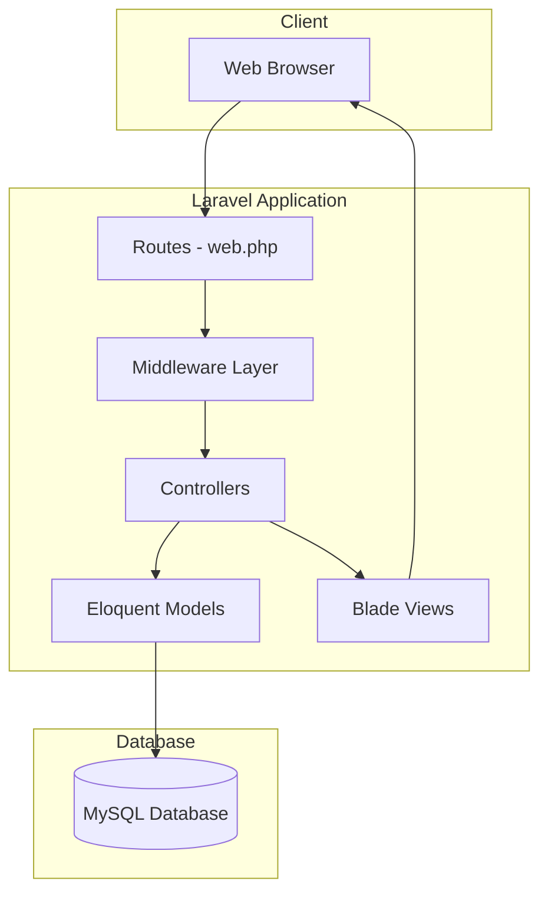

---

## Entity Relationship Diagram

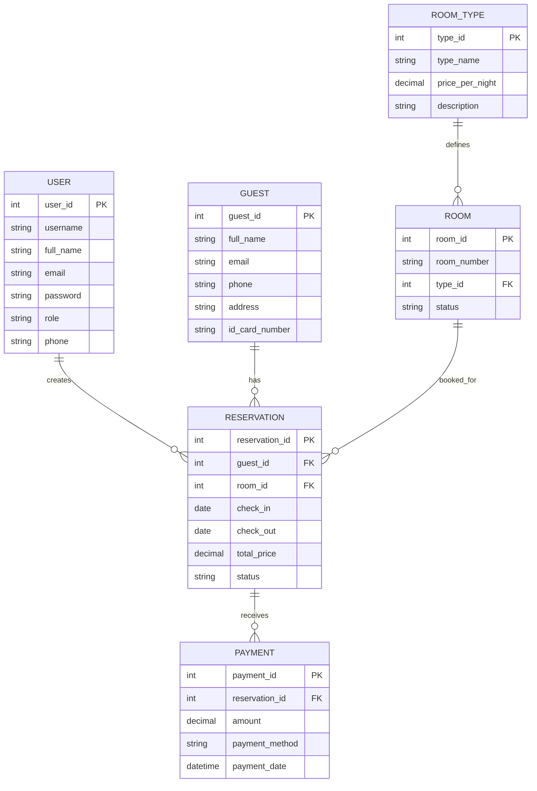

---

## User Roles and Access Control

The system has two user roles with different access levels:

| Role | Access Level | Permissions |
|------|-------------|-------------|
| **Admin** | Full Access | Dashboard, Guests, Reservations, Rooms, Payments, Users Management |
| **Staff** | Operational Access | Dashboard, Guests, Reservations, Rooms, Payments |

### Middleware Flow

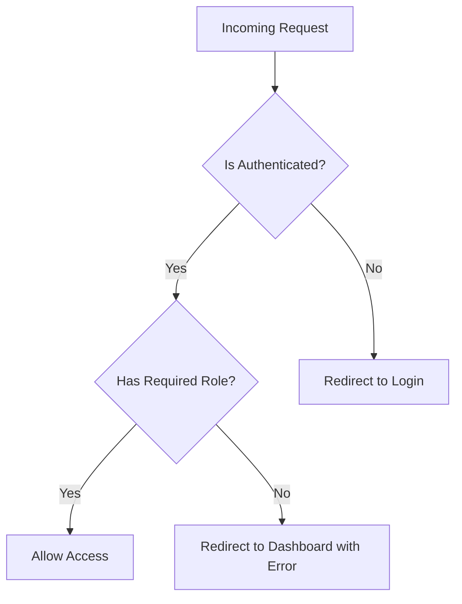

---

## Core Process Flows

### 1. Authentication Flow

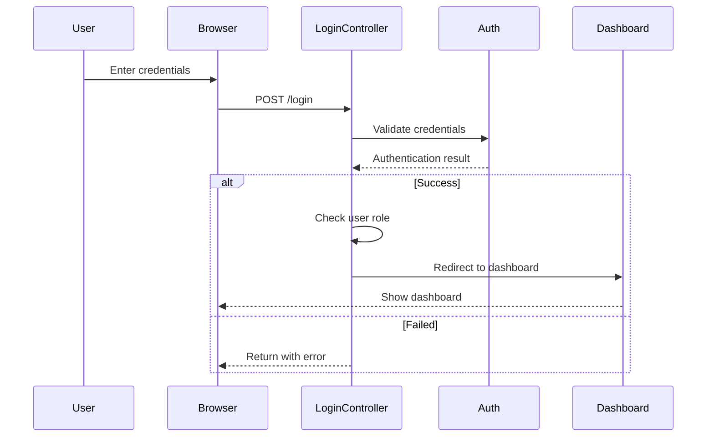

**Key Files:**
- [`routes/web.php`](routes/web.php:17-19) - Authentication routes
- [`app/Http/Controllers/Auth/LoginController.php`](app/Http/Controllers/Auth/LoginController.php) - Login logic
- [`app/Models/User.php`](app/Models/User.php) - User model with role methods

---

### 2. Reservation Creation Flow

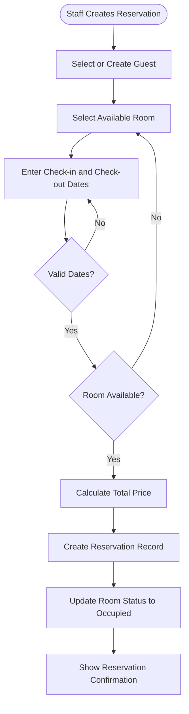

**Key Files:**
- [`app/Http/Controllers/ReservationController.php`](app/Http/Controllers/ReservationController.php:72-113) - Store method
- [`app/Models/Reservation.php`](app/Models/Reservation.php:55-60) - Price calculation

**Price Calculation Formula:**
```
Total Price = (Check-out Date - Check-in Date) × Price Per Night
```

---

### 3. Check-in and Check-out Flow

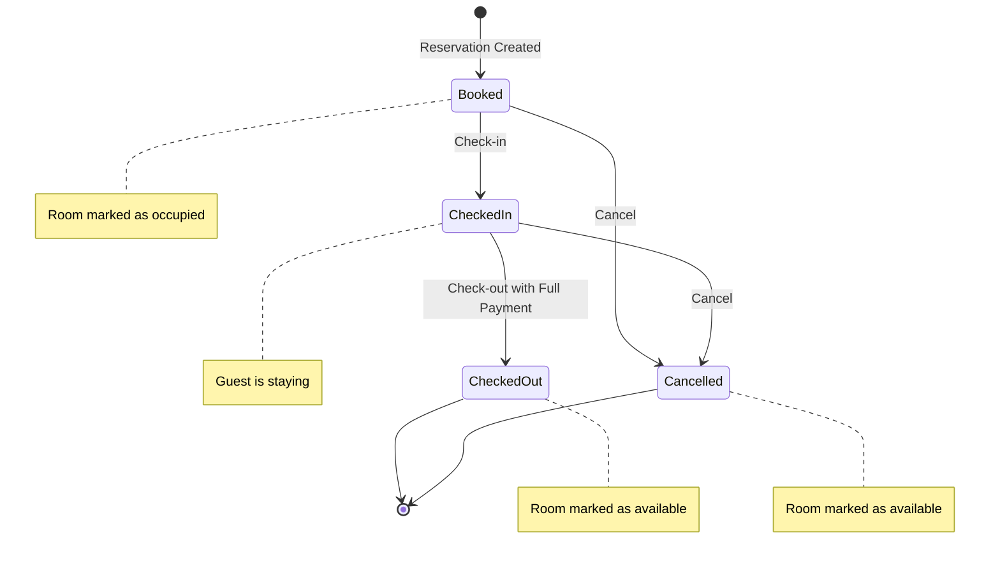

**Reservation Status Transitions:**

| Current Status | Action | Next Status | Room Status |
|---------------|--------|-------------|-------------|
| `booked` | Check-in | `checked_in` | `occupied` |
| `checked_in` | Check-out | `checked_out` | `available` |
| `booked` | Cancel | `cancelled` | `available` |
| `checked_in` | Cancel | `cancelled` | `available` |

**Key Methods:**
- [`Reservation::checkIn()`](app/Models/Reservation.php:84-92) - Handles check-in logic
- [`Reservation::checkOut()`](app/Models/Reservation.php:94-102) - Handles check-out logic
- [`Reservation::cancel()`](app/Models/Reservation.php:74-82) - Handles cancellation

---

### 4. Payment Processing Flow

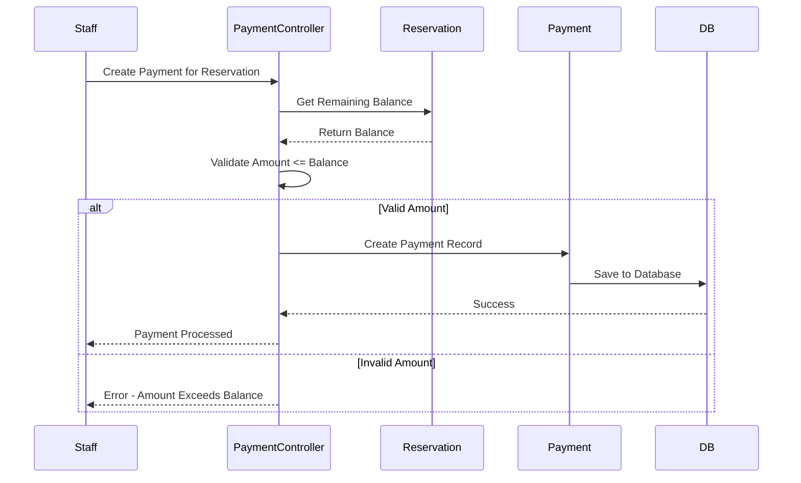

**Payment Methods Supported:**
- Cash
- Card
- Online

**Key Files:**
- [`app/Http/Controllers/PaymentController.php`](app/Http/Controllers/PaymentController.php:38-79) - Payment processing
- [`app/Models/Payment.php`](app/Models/Payment.php) - Payment model

---

### 5. Room Management Flow

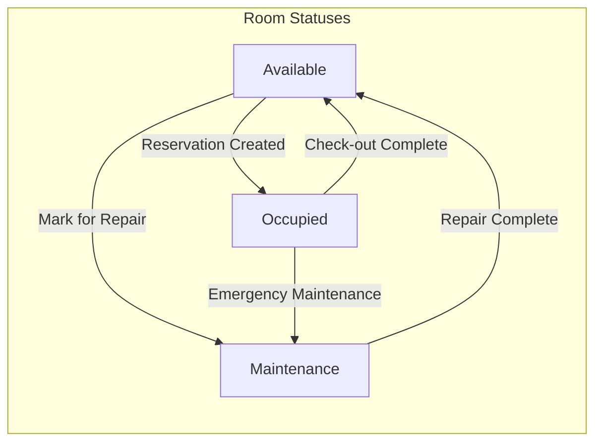

**Key Files:**
- [`app/Http/Controllers/RoomController.php`](app/Http/Controllers/RoomController.php) - Room management
- [`app/Models/Room.php`](app/Models/Room.php) - Room model with status methods

---

## Complete Application Flow

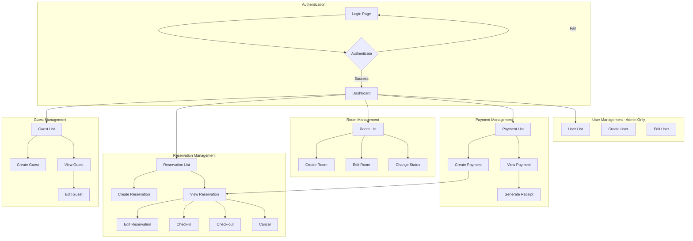

---

## Key Components Summary

### Models and Their Responsibilities

| Model | Primary Key | Key Relationships | Key Methods |
|-------|-------------|-------------------|-------------|
| [`User`](app/Models/User.php) | `user_id` | hasMany Reservations | `isAdmin()`, `isStaff()` |
| [`Guest`](app/Models/Guest.php) | `guest_id` | hasMany Reservations | - |
| [`Room`](app/Models/Room.php) | `room_id` | belongsTo RoomType, hasMany Reservations | `isAvailable()`, `changeStatus()` |
| [`RoomType`](app/Models/RoomType.php) | `type_id` | hasMany Rooms | `getFormattedPrice()` |
| [`Reservation`](app/Models/Reservation.php) | `reservation_id` | belongsTo Guest/Room, hasMany Payments | `checkIn()`, `checkOut()`, `cancel()`, `calculateTotalPrice()` |
| [`Payment`](app/Models/Payment.php) | `payment_id` | belongsTo Reservation | `getFormattedAmount()` |

### Controllers and Their Routes

| Controller | Base Route | Middleware | Purpose |
|------------|------------|------------|---------|
| [`LoginController`](app/Http/Controllers/Auth/LoginController.php) | `/login` | None | Authentication |
| [`DashboardController`](app/Http/Controllers/Dashboardcontroller.php) | `/` | auth | Overview statistics |
| [`GuestController`](app/Http/Controllers/GuestController.php) | `/guests` | auth, staff | Guest CRUD |
| [`ReservationController`](app/Http/Controllers/ReservationController.php) | `/reservations` | auth, staff | Reservation management |
| [`RoomController`](app/Http/Controllers/RoomController.php) | `/rooms` | auth, staff | Room management |
| [`PaymentController`](app/Http/Controllers/PaymentController.php) | `/payments` | auth, staff | Payment processing |
| [`UserController`](app/Http/Controllers/UserController.php) | `/users` | auth, admin | User management |

---

## Business Rules

1. **Reservation Rules:**
   - Check-in date must be today or future
   - Check-out date must be after check-in date
   - Room must be available for booking
   - Total price is automatically calculated

2. **Check-out Rules:**
   - Guest must be checked in
   - Full payment must be completed before check-out

3. **Guest Deletion Rules:**
   - Cannot delete guest with active reservations

4. **Payment Rules:**
   - Payment amount cannot exceed remaining balance
   - Multiple payments allowed per reservation

---

## User Interface Flow

### UI Architecture Overview

The application uses a **luxury hotel theme** with:
- **Tailwind CSS** for styling
- **Alpine.js** for interactive components
- **Blade Templates** for server-side rendering

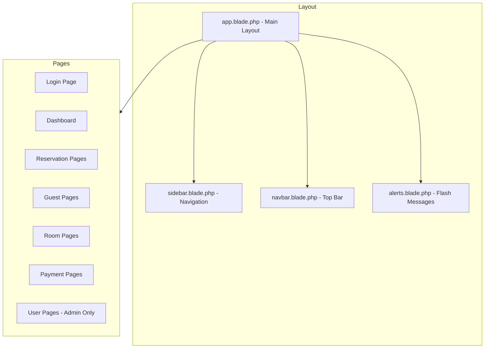

---

### Screen-by-Screen Flow

#### 1. Login Screen

**File:** [`resources/views/auth/login.blade.php`](resources/views/auth/login.blade.php)

```
┌─────────────────────────────────────────┐
│         Hotel Reservation               │
│       Sign in to your account           │
│                                         │
│  Username: [________________]           │
│  Password: [________________]           │
│                                         │
│         [    Sign In    ]               │
│                                         │
└─────────────────────────────────────────┘
```

**Flow:**
1. User enters username and password
2. Form submits to `POST /login`
3. [`LoginController::login()`](app/Http/Controllers/Auth/LoginController.php:23-36) validates credentials
4. On success → Redirect to Dashboard
5. On failure → Show error message

---

#### 2. Dashboard Screen

**File:** [`resources/views/dashboard/index.blade.php`](resources/views/dashboard/index.blade.php)

```
┌────────────────────────────────────────────────────────────────────┐
│ 🏨 Luxe Stay                    [Search...]  🔔  👤 Admin ▼       │
├────────────────┬───────────────────────────────────────────────────┤
│                │  Dashboard Overview                               │
│  📊 Dashboard  │  ─────────────────────────────────────────────    │
│                │  ┌─────────┐ ┌─────────┐ ┌─────────┐ ┌─────────┐ │
│  📅 Reservations│  │Total    │ │Active   │ │Monthly  │ │Occupancy│ │
│                │  │Rooms: 45│ │Bookings │ │Revenue  │ │Rate: 92%│ │
│  🏠 Rooms      │  └─────────┘ └─────────┘ └─────────┘ └─────────┘ │
│                │                                                    │
│  💳 Payments   │  Quick Actions:                                    │
│                │  [+ New Reservation] [Check-In] [Check-Out] [...] │
│  👥 Guests     │                                                    │
│                │  Recent Reservations                               │
│  👤 Users      │  ┌──────────────────────────────────────────────┐ │
│  (Admin Only)  │  │ ID │ Guest    │ Room │ Dates    │ Status    │ │
│                │  │ #1 │ John Doe │ 302  │ Feb 1-3  │ [Booked]  │ │
│                │  └──────────────────────────────────────────────┘ │
└────────────────┴────────────────────────────────────────────────────┘
```

**Components:**
- **Stats Cards:** Total Rooms, Active Bookings, Monthly Revenue, Occupancy Rate
- **Quick Actions:** Shortcuts to common tasks
- **Recent Reservations Table:** Last 10 bookings
- **Room Availability Table:** Available rooms with Book Now buttons

---

#### 3. Create Reservation Screen

**File:** [`resources/views/reservations/create.blade.php`](resources/views/reservations/create.blade.php)

```
┌────────────────────────────────────────────────────────────────────┐
│                         New Reservation                            │
│              Fill in the details to create a new booking           │
├────────────────────────────────────────────────────────────────────┤
│                                                                    │
│  👤 Guest Information                                              │
│  ─────────────────────────────────────────────────────────────    │
│  Select Guest: [Choose a guest...        ▼]  [+ New]              │
│                                                                    │
│  📅 Booking Dates                                                  │
│  ─────────────────────────────────────────────────────────────    │
│  Check-In Date:  [____________]     Check-Out Date: [____________]│
│                                                                    │
│  ┌─────────────────────────────────────────────────────────────┐  │
│  │ Total Nights: 3                                              │  │
│  └─────────────────────────────────────────────────────────────┘  │
│                                                                    │
│  🏠 Room Selection                                                 │
│  ─────────────────────────────────────────────────────────────    │
│  Select Room: [Choose a room...                            ▼]     │
│                                                                    │
│  ┌─────────────────────────────────────────────────────────────┐  │
│  │ Price Summary                                                │  │
│  │ Price per night:                    $150.00                  │  │
│  │ Number of nights:                   3                        │  │
│  │ ─────────────────────────────────────────                   │  │
│  │ Total Amount:                       $450.00                  │  │
│  └─────────────────────────────────────────────────────────────┘  │
│                                                                    │
│                    [Cancel]  [✓ Create Reservation]               │
└────────────────────────────────────────────────────────────────────┘
```

**Interactive Features (Alpine.js):**
1. **Date Selection:** Automatically calculates number of nights
2. **Room Selection:** Updates price summary in real-time
3. **New Guest Modal:** Quick guest creation without leaving page
4. **Price Calculator:** Shows total = nights × price per night

---

#### 4. Reservation Detail Screen

**File:** [`resources/views/reservations/show.blade.php`](resources/views/reservations/show.blade.php)

```
┌────────────────────────────────────────────────────────────────────┐
│  Reservation #00001                              [Booked]          │
│  Created Feb 01, 2026                                              │
├────────────────────────────────────────────────────────────────────┤
│  Guest Information              │  Room Information                │
│  ┌────┐                         │  Room Number:  302               │
│  │ JD │ John Doe                │  Room Type:    [Deluxe]          │
│  └────┘ john@email.com          │  Price/Night:  $150.00           │
│         555-1234                │                                  │
│  ─────────────────────────────────────────────────────────────    │
│  Check-In: Feb 01   │ Check-Out: Feb 04   │ Duration: 3 Nights    │
├────────────────────────────────────────────────────────────────────┤
│  Payment Details                              [+ Add Payment]      │
│  ┌─────────────────────────────────────────────────────────────┐  │
│  │ Total Amount:    $450.00                                     │  │
│  │ Total Paid:      $200.00                                     │  │
│  │ Balance:         $250.00                                     │  │
│  └─────────────────────────────────────────────────────────────┘  │
│  Payment History:                                                  │
│  ✓ $200.00 - Card - Feb 01, 2026 10:30 AM                         │
├────────────────────────────────────────────────────────────────────┤
│  Quick Actions                                                     │
│  ┌─────────────────────────────────────────────────────────────┐  │
│  │ [✓ Check In]                                                 │  │
│  │ [Edit Reservation]                                           │  │
│  │ [Cancel Reservation]                                         │  │
│  │ [Back to List]                                               │  │
│  └─────────────────────────────────────────────────────────────┘  │
└────────────────────────────────────────────────────────────────────┘
```

**Conditional Action Buttons:**
| Status | Available Actions |
|--------|------------------|
| `booked` | Check In, Edit, Cancel |
| `checked_in` | Check Out*, Edit, Cancel |
| `checked_out` | Back to List only |
| `cancelled` | Back to List only |

*Check Out only enabled when fully paid

---

### Complete User Journey Flow

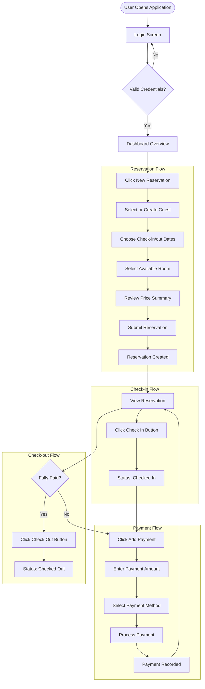

---

### UI Components Reference

#### Status Badges

**File:** [`resources/views/components/status-badge.blade.php`](resources/views/components/status-badge.blade.php)

| Status | Badge Style |
|--------|-------------|
| `booked` | Yellow/Amber badge |
| `checked_in` | Blue badge |
| `checked_out` | Gray badge |
| `cancelled` | Red badge |

#### Room Status Badges

**File:** [`resources/views/components/room-status-badge.blade.php`](resources/views/components/room-status-badge.blade.php)

| Status | Badge Style |
|--------|-------------|
| `available` | Green badge |
| `occupied` | Red badge |
| `maintenance` | Yellow badge |

---

### Navigation Structure

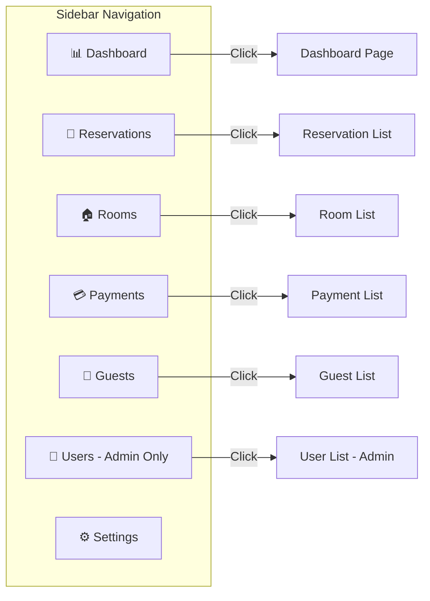

---

### JavaScript Interactions

The application uses **Alpine.js** for frontend interactivity:

1. **Reservation Form** ([`reservations/create.blade.php`](resources/views/reservations/create.blade.php:270-338))
   - `x-data="reservationForm()"` - Main form controller
   - `x-model` - Two-way data binding
   - `@change="calculateNights()"` - Auto-calculate nights
   - `@change="updatePrice()"` - Update price summary
   - Modal for quick guest creation

2. **User Dropdown** ([`layouts/navbar.blade.php`](resources/views/layouts/navbar.blade.php:67-116))
   - `x-data="{ open: false }"` - Toggle state
   - `@click="open = !open"` - Toggle dropdown
   - `@click.away="open = false"` - Close on outside click

3. **Notifications** ([`layouts/navbar.blade.php`](resources/views/layouts/navbar.blade.php:30-64))
   - Dropdown with notification list
   - Click outside to close

---

## Technology Stack

- **Backend Framework:** Laravel (PHP)
- **Database:** MySQL
- **Frontend:** Blade Templates + Tailwind CSS
- **JavaScript:** Alpine.js (for interactivity)
- **Authentication:** Laravel Auth
- **Asset Bundling:** Vite

---

## Project Purpose

### Overview

This **Hotel Reservation System** is a web-based application designed to digitize and streamline hotel operations. It serves as a comprehensive management tool for hotels to handle:

1. **Room Management** - Track room availability, types, and pricing
2. **Guest Management** - Store and manage guest information
3. **Reservation Management** - Handle booking lifecycle from creation to checkout
4. **Payment Processing** - Track payments and outstanding balances
5. **User Management** - Control staff access with role-based permissions

### Target Users

| User Role | Primary Functions |
|-----------|-------------------|
| **Hotel Administrators** | Full system access, user management, view all reports |
| **Front Desk Staff** | Create reservations, check-in/out guests, process payments |

### Business Problems Solved

1. **Manual Booking Elimination** - Replaces paper-based reservation books
2. **Real-time Availability** - Instant visibility of room status
3. **Payment Tracking** - Prevents revenue leakage from untracked payments
4. **Guest History** - Maintains records for returning guests
5. **Operational Efficiency** - Streamlines check-in/check-out processes

---

## Advantages

### 1. Technical Advantages

| Advantage | Description |
|-----------|-------------|
| **MVC Architecture** | Clean separation of concerns makes code maintainable and testable |
| **Eloquent ORM** | Database operations are intuitive and secure from SQL injection |
| **Middleware Protection** | Role-based access control protects sensitive operations |
| **Blade Templates** | Reusable components reduce code duplication |
| **CSRF Protection** | Built-in security against cross-site request forgery |
| **Transaction Support** | Database transactions ensure data integrity |

### 2. Business Advantages

| Advantage | Description |
|-----------|-------------|
| **Centralized Management** | All hotel operations in one system |
| **Real-time Updates** | Room status changes immediately reflected |
| **Payment Flexibility** | Supports multiple payments per reservation |
| **Guest Database** | Build customer relationships with history tracking |
| **Role-based Access** | Staff can only access authorized functions |
| **Automated Calculations** | Price automatically calculated from dates and room type |

### 3. User Experience Advantages

| Advantage | Description |
|-----------|-------------|
| **Modern UI** | Luxury-themed design with Tailwind CSS |
| **Responsive Design** | Works on desktop and mobile devices |
| **Interactive Forms** | Real-time price calculation with Alpine.js |
| **Quick Actions** | Dashboard shortcuts for common tasks |
| **Visual Status Indicators** | Color-coded badges for easy status recognition |
| **Modal Dialogs** | Quick guest creation without page navigation |

### 4. Code Quality Advantages

| Advantage | Description |
|-----------|-------------|
| **OOP Principles** | Models contain business logic methods like `checkIn()`, `checkOut()` |
| **Relationships Defined** | Eloquent relationships make data access intuitive |
| **Validation Built-in** | Form validation at both client and server level |
| **Error Handling** | Try-catch blocks with database rollback on failure |
| **Clean Code** | Well-organized controllers and models |

---

## Disadvantages

### 1. Technical Limitations

| Disadvantage | Description | Impact |
|--------------|-------------|--------|
| **No API Layer** | No REST API for mobile app integration | Cannot build mobile apps easily |
| **No Real-time Updates** | Uses polling, not WebSockets | Multiple users may see stale data |
| **No Caching** | Direct database queries for all operations | Performance issues at scale |
| **No Queue System** | Synchronous processing only | Slow operations block users |
| **No Test Coverage** | Only example tests exist | Risk of regressions |

### 2. Feature Gaps

| Disadvantage | Description | Impact |
|--------------|-------------|--------|
| **No Online Booking** | Staff-only system | Guests cannot book directly |
| **No Payment Gateway** | Manual payment recording only | No actual payment processing |
| **No Email Notifications** | No confirmation emails | Manual communication required |
| **No Reporting** | Basic stats only | Limited business insights |
| **No Multi-property** | Single hotel only | Cannot manage multiple locations |
| **No Inventory** | Room items not tracked | Cannot manage amenities |

### 3. Security Concerns

| Disadvantage | Description | Risk Level |
|--------------|-------------|------------|
| **No Rate Limiting** | Login not protected from brute force | Medium |
| **No 2FA** | Single-factor authentication only | Medium |
| **No Audit Logging** | Actions not logged | Medium |
| **No Password Policy** | Weak passwords allowed | Low |
| **Session Management** | Basic session handling only | Low |

### 4. Scalability Issues

| Disadvantage | Description | Impact |
|--------------|-------------|--------|
| **Monolithic Architecture** | All-in-one codebase | Hard to scale horizontally |
| **No Load Balancing** | Single server deployment | Cannot handle high traffic |
| **File-based Sessions** | Sessions stored locally | Issues with multiple servers |
| **No CDN Integration** | Static assets served locally | Slower asset loading |

### 5. User Experience Limitations

| Disadvantage | Description | Impact |
|--------------|-------------|--------|
| **No Search Functionality** | Search bar is decorative | Hard to find records |
| **No Pagination on All Lists** | Some lists may grow large | Performance and usability issues |
| **No Bulk Operations** | One record at a time | Time-consuming for mass updates |
| **No Data Export** | Cannot export to Excel/PDF | Reporting limitations |
| **No Offline Mode** | Requires internet connection | Cannot work during outages |

---

## Recommendations for Improvement

### Short-term Improvements

1. **Add Search Functionality** - Implement search for guests, reservations, rooms
2. **Add Audit Logging** - Track who did what and when
3. **Add Email Notifications** - Send booking confirmations
4. **Add Export Feature** - Export reports to PDF/Excel
5. **Write Tests** - Unit and feature tests for reliability

### Long-term Improvements

1. **Build REST API** - Enable mobile app development
2. **Integrate Payment Gateway** - Accept actual online payments
3. **Add Real-time Features** - Use Laravel Echo + WebSockets
4. **Implement Caching** - Redis for frequently accessed data
5. **Add Reporting Module** - Revenue, occupancy, and guest analytics
6. **Multi-property Support** - Manage multiple hotels from one system

---

## Conclusion

This Hotel Reservation System is a **solid foundation** for hotel management software. It demonstrates good use of Laravel's features and follows MVC best practices. The codebase is clean and maintainable.

**Best suited for:**
- Small to medium hotels
- Educational projects
- Starting point for larger systems

**Not suited for:**
- Large hotel chains
- Properties needing online booking
- Organizations requiring payment processing

The system successfully handles core hotel operations but would need additional features for production use in a commercial environment.
